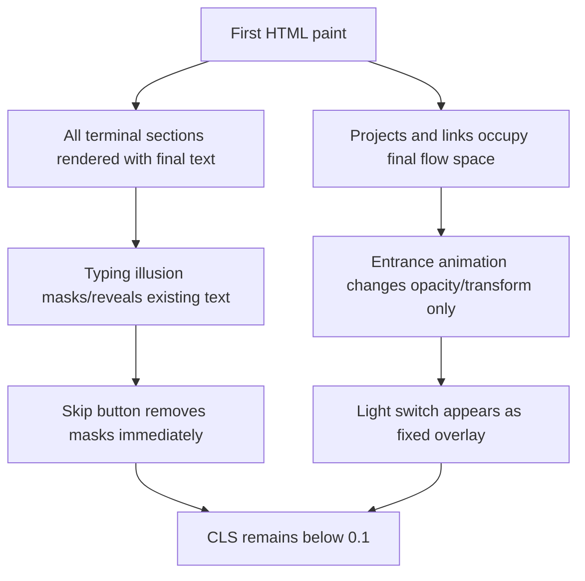

# fix: Stabilize homepage CLS

## Summary

Fix the homepage mobile performance score by removing layout-changing terminal reveal behavior and replacing the oversized shared profile image references with purpose-built assets. The page should preserve the retro terminal feel, but the document height and visible flow must be stable from first paint.

---

## Problem Frame

The PageSpeed audit shows strong FCP, LCP, Speed Index, and TBT, but a poor CLS score around `0.378`. Local inspection confirms the homepage initially hides core content with `display: none`, then reveals sections and inserts text node by node while Lighthouse is measuring layout movement.

---

## Assumptions

*This plan was authored without synchronous user confirmation. The items below are agent inferences that fill gaps in the input -- un-validated bets that should be reviewed before implementation proceeds.*

- The homepage should keep its terminal-style personality, skip control, and light-switch handoff to `/os`.
- The primary success target is mobile PageSpeed Performance above `90`, with CLS below `0.1`.
- The original high-resolution `public/profile.png` may remain as a source image, but it should not be referenced by deployed metadata, favicons, or visible avatar slots.
- The current dirty working tree contains unrelated in-progress OS/app work; implementation should avoid broad refactors and only touch files needed for CLS and asset optimization.

---

## Requirements

- R1. Reduce homepage CLS below `0.1` by ensuring terminal sections, project cards, links, and controls do not change document flow after first paint.
- R2. Preserve the visible terminal experience with an animation that does not grow text height or reveal block-level content late.
- R3. Keep the existing Astro/static architecture and avoid introducing heavy client-side dependencies for the homepage.
- R4. Replace `public/profile.png` as the favicon, OG, Twitter, JSON-LD, and avatar reference with appropriately sized optimized assets.
- R5. Add regression coverage so future edits do not reintroduce hidden-first-render sections, oversized social assets, or layout-shifting homepage behavior.
- R6. Verify with the repo's existing build/test paths and a mobile PageSpeed or Lighthouse run after implementation.

---

## Scope Boundaries

- Do not redesign the portfolio visual language, project content, blog content, or `/os` experience.
- Do not migrate the homepage into React or move shared portfolio data unless implementation proves that a small local helper is necessary.
- Do not optimize every image and font across the whole site; this plan targets `profile.png` references and homepage CLS.
- Do not remove the terminal typing illusion entirely unless a no-layout-shift variant fails verification.

### Deferred to Follow-Up Work

- Broader performance budget enforcement for all routes can be planned separately after this CLS fix lands.
- Consolidating duplicated metadata logic across standalone Astro pages can be considered later if the asset-reference patch exposes enough duplication to justify it.

---

## Context & Research

### Relevant Code and Patterns

- `src/pages/index.astro` owns the audited homepage, inline metadata, terminal sections, project reveal, links reveal, skip button, light switch, and the layout-shifting script.
- `src/data/portfolioData.ts` is the source for terminal copy, project labels, and social links. The plan should keep this as the content source.
- `src/layouts/BaseLayout.astro`, `src/pages/os.astro`, `src/pages/blog/index.astro`, `src/pages/blog/[slug].astro`, `src/pages/about.astro`, and `src/components/react/PortfolioPage.tsx` also reference `profile.png`, so the asset fix should cover the wider deployed surface.
- `playwright.config.ts` and `tests/os-flow.spec.ts` establish Playwright as the existing browser regression path.
- `package.json` already includes `astro build`, `vitest`, and Playwright scripts. No new runtime dependency is needed for the main fix.

### Institutional Learnings

- No `docs/solutions/` directory or relevant repo-local planning documents were present during planning.

### External References

- Google web.dev CLS guidance: good CLS is `0.1` or less; common causes include dynamically injected content and images without dimensions; stable fixes reserve space up front and animate with `transform`/`opacity` rather than layout-changing properties.

---

## Key Technical Decisions

- Render final terminal text into the HTML from the start, then animate a mask or overlay rather than appending characters. This reserves the final text height before Lighthouse starts measuring.
- Keep all homepage sections in document flow from first paint. Visibility effects should use non-layout properties such as `opacity`, `clip-path`, mask width, or transform-based overlays.
- Treat projects and links as initially laid-out content, not post-animation inserts. Their visual entrance can be delayed, but their space must already be accounted for.
- Use dedicated image assets by use case: favicon, Apple touch icon, social preview, and optional display avatar. This avoids shipping the 8.9 MB source image for tiny metadata slots.
- Add a Playwright homepage performance regression that observes layout shifts in-browser and asserts the final CLS budget, rather than relying only on manual PageSpeed screenshots.

---

## Open Questions

### Resolved During Planning

- Should this be a full performance rewrite? No. Existing FCP, LCP, TBT, and Speed Index are already strong, so the active scope is CLS plus the oversized profile asset references.
- Should the terminal animation stay? Yes, but only as a no-layout-shift illusion.

### Deferred to Implementation

- Exact animation technique: choose the smallest CSS/DOM approach that preserves the terminal feel after seeing the final markup shape.
- Exact image generation tool: use the available local image tooling during implementation, but validate output dimensions and byte sizes after creation.
- Exact PageSpeed score: final score depends on the deployed URL and PageSpeed run, so implementation should verify after shipping or previewing the built site.

---

## High-Level Technical Design

> *This illustrates the intended approach and is directional guidance for review, not implementation specification. The implementing agent should treat it as context, not code to reproduce.*

---

## Implementation Units

### U1. Stabilize Homepage Terminal Layout

**Goal:** Remove the hidden-first-render and text-node insertion behavior that causes the homepage to grow while Lighthouse measures CLS.

**Requirements:** R1, R2, R3

**Dependencies:** None

**Files:**
- Modify: `src/pages/index.astro`
- Test: `tests/homepage-cls.spec.ts`

**Approach:**
- Render each terminal section's final text in the initial HTML, using the existing `portfolioData.sections` source.
- Replace `.section { display: none; }`, `.section.visible { display: block; }`, and similar project/link flow toggles with classes that keep layout space stable.
- Replace the `output.insertBefore(document.createTextNode(...), cursor)` typing loop with a visual reveal that does not change element height or line wrapping after first paint.
- Keep the skip action, but make it complete visual animation state rather than populate missing layout content.
- Keep the fixed-position light switch outside normal flow so its appearance cannot push document content.

**Execution note:** Start with a Playwright characterization test that records homepage layout-shift entries before changing the animation, so the fix has a measurable before/after guard.

**Patterns to follow:**
- Preserve the inline Astro page structure in `src/pages/index.astro`.
- Continue reading content from `src/data/portfolioData.ts` rather than duplicating copy in JavaScript.

**Test scenarios:**
- Happy path: visiting `/` on a mobile viewport renders the terminal commands, section text, projects, writing section, and links with no late block insertion.
- Happy path: the terminal animation progresses visually while the measured CLS remains below `0.1`.
- Edge case: clicking `skip >>` immediately after navigation reveals the final visual state without increasing measured CLS above budget.
- Edge case: final terminal text wraps consistently at mobile width and does not change line count as animation progresses.
- Integration: after animation completion, the light switch appears and remains fixed-position without pushing content down.

**Verification:**
- The homepage no longer contains layout-critical `display: none` toggles for terminal sections, projects, or links.
- No homepage script appends terminal text one character at a time into the live layout.
- The Playwright homepage CLS check passes on the mobile viewport.

---

### U2. Replace Oversized Profile Asset References

**Goal:** Stop using the 8.9 MB `public/profile.png` as metadata, favicon, and avatar output.

**Requirements:** R4

**Dependencies:** None

**Files:**
- Create: `public/favicon-32.png`
- Create: `public/apple-touch-icon.png`
- Create: `public/og-image.jpg`
- Create: `public/profile-avatar.webp`
- Modify: `src/pages/index.astro`
- Modify: `src/layouts/BaseLayout.astro`
- Modify: `src/pages/os.astro`
- Modify: `src/pages/blog/index.astro`
- Modify: `src/pages/blog/[slug].astro`
- Modify: `src/pages/about.astro`
- Modify: `src/components/react/PortfolioPage.tsx`
- Test: `tests/homepage-cls.spec.ts`

**Approach:**
- Generate dedicated assets from the source image with target sizes: 32x32 favicon, 180x180 Apple touch icon, 1200x630 social image, and a 300-600px WebP avatar.
- Update all favicon links to use the favicon and Apple touch icon assets.
- Update OG, Twitter, and JSON-LD image references to use the social image URL.
- Update visible avatar slots to use `profile-avatar.webp` with explicit `width` and `height` attributes or CSS aspect-ratio constraints.
- Leave `public/profile.png` only as an optional source asset unless implementation decides to remove it in a separate cleanup.

**Patterns to follow:**
- Use the existing route-local metadata pattern in standalone pages.
- Use `BaseLayout.astro` defaults for routes that already consume that layout.

**Test scenarios:**
- Happy path: homepage metadata references `/favicon-32.png`, `/apple-touch-icon.png`, and `/og-image.jpg`, not `/profile.png`.
- Happy path: `/about`, `/blog`, blog detail pages, and `/os` no longer emit `profile.png` for icon or social preview metadata.
- Edge case: visible avatar images reserve layout space before loading because dimensions or aspect ratio are present.
- Integration: built output does not contain metadata references to `profile.png` except any deliberately preserved source-file documentation.

**Verification:**
- Generated social and icon assets have the intended dimensions and reasonable byte sizes, with `og-image.jpg` ideally under 200 KB.
- `rg "profile\\.png"` confirms no deployed HTML/TSX metadata or avatar references still use the original asset.

---

### U3. Add Homepage Regression Coverage

**Goal:** Add focused automated checks for the exact CLS and asset mistakes found by the audit.

**Requirements:** R1, R4, R5

**Dependencies:** U1, U2

**Files:**
- Create: `tests/homepage-cls.spec.ts`
- Modify: `playwright.config.ts` only if the existing config needs a mobile project or viewport entry

**Approach:**
- Add a homepage Playwright spec that runs at a representative mobile viewport.
- Measure cumulative layout shift using the browser's layout-shift performance entries and assert the CLS budget.
- Assert the skip control and completed terminal state remain usable after the animation changes.
- Assert metadata asset URLs do not point to `profile.png`.
- Keep the test narrow so it protects this performance bug without duplicating broad end-to-end coverage.

**Execution note:** Write the test around user-visible outcomes and the browser CLS measurement, not implementation class names, except where metadata selectors are the behavior under test.

**Patterns to follow:**
- Follow the existing Playwright style in `tests/os-flow.spec.ts`.
- Use the configured base URL from `playwright.config.ts`.

**Test scenarios:**
- Happy path: homepage loads on mobile and cumulative layout shift stays below `0.1` through the typing animation window.
- Happy path: clicking skip reaches the final state and the light switch remains available.
- Edge case: metadata assertions catch a regression where favicon, OG, Twitter, or JSON-LD image references return to `/profile.png`.
- Integration: the test passes against the built Astro preview, proving the static output and inline script work together.

**Verification:**
- `npm run test:e2e` includes the new homepage coverage and passes after the fix.

---

### U4. Build and Field-Verify the Performance Fix

**Goal:** Confirm the static build remains healthy and the external performance score improves on the real measurement path.

**Requirements:** R3, R6

**Dependencies:** U1, U2, U3

**Files:**
- Modify: none expected
- Test: `tests/homepage-cls.spec.ts`

**Approach:**
- Build the Astro site and run the focused unit/e2e checks available in the repo.
- Preview the built output and verify the homepage visual sequence manually at desktop and mobile sizes.
- Re-run PageSpeed mobile or Lighthouse against the deployed/preview URL and compare CLS against the original `0.378` audit.
- If CLS remains above `0.1`, use the Lighthouse diagnostics to identify the remaining shifting element before expanding scope.

**Patterns to follow:**
- Use the existing `package.json` scripts and Astro preview flow.

**Test scenarios:**
- Test expectation: none -- this unit is verification and rollout confirmation for the preceding feature-bearing units.

**Verification:**
- Static build succeeds.
- Browser regression checks pass.
- Manual mobile inspection shows no text, project, link, or light-switch overlap.
- PageSpeed mobile reports CLS below `0.1`; expected performance score is above `90` if the rest of the audit remains similar.

---

## System-Wide Impact

- **Interaction graph:** Homepage inline script, skip button, section reveal, projects reveal, links reveal, and light-switch entrance all converge in `src/pages/index.astro`.
- **Error propagation:** If JavaScript fails, the final terminal text should still be readable because content is rendered in HTML rather than inserted by script.
- **State lifecycle risks:** The skip and animation-complete states must not diverge; both should arrive at the same final visible state.
- **API surface parity:** Metadata changes should be consistent across route-local pages and `BaseLayout.astro`.
- **Integration coverage:** Browser-level CLS and metadata assertions are needed because unit tests will not catch layout shift or generated HTML references.
- **Unchanged invariants:** Portfolio content stays in `src/data/portfolioData.ts`; `/os` route behavior, project links, blog routing, and social links remain unchanged.

---

## Risks & Dependencies

| Risk | Mitigation |
|------|------------|
| The typing illusion becomes less convincing after removing text insertion | Use a mask/cursor overlay that visually mimics typing while keeping final text in flow |
| Reserved project/link space creates visible empty gaps during animation | Prefer a fast entrance, opacity reveal, or skeleton-like terminal prompt that reads intentionally while preserving layout |
| Generated OG image crop looks poor | Validate the 1200x630 crop visually before committing the asset |
| Tests become flaky if CLS observer timing is too tight | Observe through the full animation window and assert a budget with a small buffer below PageSpeed's threshold |
| Dirty worktree changes collide with implementation | Keep implementation scoped to the files listed in each unit and review diffs before applying edits |

---

## Documentation / Operational Notes

- No user-facing documentation is required.
- Keep the PageSpeed before/after values in the implementation handoff or PR notes: original mobile CLS was reported as `0.378`; target is below `0.1`.
- If the site is deployed after implementation, verify the live canonical URL rather than only local preview.

---

## Sources & References

- Origin input: PageSpeed audit summary provided in the user request.
- Related code: `src/pages/index.astro`
- Related code: `src/data/portfolioData.ts`
- Related code: `src/layouts/BaseLayout.astro`
- Related code: `tests/os-flow.spec.ts`
- External docs: `https://web.dev/optimize-cls/`
- External docs: `https://web.dev/articles/cls`
